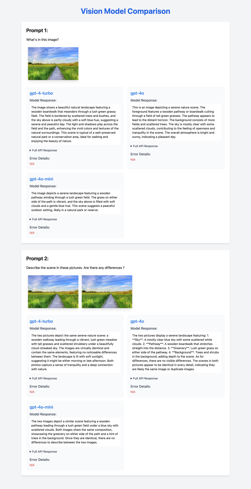

To run
```
pip install openai

python run.py --prompts_file=<path to the prompts file> --openai_api_key=<api key for openai>

```
Sample prompts schema. Same as what would be passed to 'content' field in openai chat completions api.

```
  {
  "prompts": [
    [
      {
        "type": "text",
        "text": "What's in this image?"
      },
      {
        "type": "image_url",
        "image_url": {
          "url": "https://upload.wikimedia.org/wikipedia/commons/thumb/d/dd/Gfp-wisconsin-madison-the-nature-boardwalk.jpg/2560px-Gfp-wisconsin-madison-the-nature-boardwalk.jpg"
        }
      }
    ],
    [
      {
        "type": "text",
        "text": "Describe the scene in these pictures. Are there any differences ?"
      },
      {
        "type": "image_url",
        "image_url": {
          "url": "https://upload.wikimedia.org/wikipedia/commons/thumb/d/dd/Gfp-wisconsin-madison-the-nature-boardwalk.jpg/2560px-Gfp-wisconsin-madison-the-nature-boardwalk.jpg"
        }
      },
      {
        "type": "image_url",
        "image_url": {
          "url": "https://upload.wikimedia.org/wikipedia/commons/thumb/d/dd/Gfp-wisconsin-madison-the-nature-boardwalk.jpg/2560px-Gfp-wisconsin-madison-the-nature-boardwalk.jpg"
        }
      }
    ]
  ]
}
```
The report will be generated as ***vision_model_comparison_report.html*** in the same directory.


